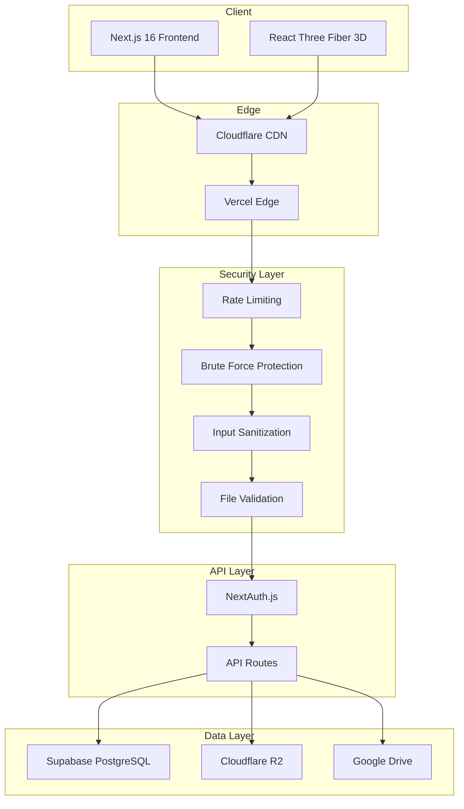

# 🎯 Production Readiness Assessment Report

**Project:** 3D Web - E-commerce Platform for 3D Printing  
**Assessment Date:** 2026-01-24  
**Overall Score:** **82/100 - Production Ready with Recommendations**

---

## 📊 Executive Summary

This 3D E-commerce platform demonstrates **strong production readiness** with comprehensive security implementations, proper error handling, and well-documented deployment procedures. The system uses modern technologies (Next.js 16, Supabase, Cloudflare R2) with a focus on security-first architecture.

### Overall Rating by Category

| Category | Score | Status |
|----------|-------|--------|
| 🔒 Security | 90/100 | ✅ Excellent |
| 🗄️ Database | 85/100 | ✅ Good |
| 📝 Documentation | 85/100 | ✅ Good |
| 🧪 Testing | 75/100 | ⚠️ Needs Enhancement |
| 📈 Monitoring | 65/100 | ⚠️ Needs Enhancement |
| ⚡ Performance | 80/100 | ✅ Good |
| 🔄 CI/CD | 60/100 | ⚠️ Not Configured |
| 🛡️ Error Handling | 85/100 | ✅ Good |

---

## 🔒 1. Security Assessment - Score: 90/100

### ✅ Implemented Features

#### 1.1 Security Headers (Excellent)
Location: [`next.config.ts`](next.config.ts:10-55)

```
✅ Content-Security-Policy (CSP)
✅ Strict-Transport-Security (HSTS) - 2 years with preload
✅ X-Frame-Options: SAMEORIGIN
✅ X-Content-Type-Options: nosniff
✅ X-XSS-Protection
✅ Referrer-Policy: strict-origin-when-cross-origin
✅ Permissions-Policy (camera, microphone, geolocation disabled)
✅ Source maps disabled in production
✅ X-Powered-By header removed
```

#### 1.2 API Rate Limiting (Excellent)
Location: [`src/lib/security/api-rate-limit.ts`](src/lib/security/api-rate-limit.ts:1-166)

| Endpoint | Limit | Window |
|----------|-------|--------|
| /api/auth/register | 5 | 1 hour |
| /api/auth/login | 10 | 15 min |
| /api/auth/forgot-password | 3 | 1 hour |
| /api/upload | 30 | 1 hour |
| /api/analyze-stl | 5 | 1 min |
| Default | 100 | 1 min |

#### 1.3 Brute Force Protection
Location: [`src/lib/security/brute-force.ts`](src/lib/security/brute-force.ts:1-181)

```
✅ Max 5 failed attempts
✅ 30-minute block duration
✅ 15-minute attempt window
✅ Database-backed tracking
✅ Admin unblock capability
```

#### 1.4 Input Validation & Sanitization
Location: [`src/lib/security/sanitize.ts`](src/lib/security/sanitize.ts:1-116)

```
✅ HTML sanitization (DOMPurify)
✅ XSS protection
✅ URL validation (blocks javascript:, data: protocols)
✅ Object sanitization for API payloads
```

#### 1.5 File Upload Security
Location: [`src/lib/security/file-validation.ts`](src/lib/security/file-validation.ts:1-259)

```
✅ Magic bytes validation
✅ MIME type verification
✅ File size limits (100MB max)
✅ Filename sanitization (path traversal prevention)
✅ STL-specific validation (triangle count limits)
```

#### 1.6 Authentication
Location: [`src/auth.ts`](src/auth.ts:1-125)

```
✅ NextAuth.js v5 beta with JWT strategy
✅ Supabase adapter
✅ bcrypt password hashing
✅ Generic error messages (prevents user enumeration)
✅ Email verification requirement
✅ Account expiration for unverified accounts (15 min)
```

### ⚠️ Recommendations

| Issue | Priority | Recommendation |
|-------|----------|----------------|
| Refresh token rotation | Medium | Implement token rotation as noted in [`SECURITY_CHECKLIST.md`](SECURITY_CHECKLIST.md:56) |
| CSRF protection | Medium | Verify CSRF tokens on state-changing operations |
| Redis-based rate limiting | Low | Current in-memory works for single instance; consider Redis for multi-instance |

---

## 🗄️ 2. Database Assessment - Score: 85/100

### ✅ Implemented Features

Location: [`supabase-schema.sql`](supabase-schema.sql:1-235)

#### 2.1 Row Level Security (RLS)
```sql
✅ RLS enabled on all tables:
   - profiles, addresses, products
   - orders, order_items, payments, faqs
   
✅ Proper policies:
   - Users can only view/update own data
   - Admins have full access
   - Public can read active products/FAQs
```

#### 2.2 Database Indexes
```
✅ idx_products_status
✅ idx_products_slug
✅ idx_orders_user_id
✅ idx_orders_status
✅ idx_orders_type
✅ idx_order_items_order
```

#### 2.3 Data Integrity
```
✅ CHECK constraints on order_type, status
✅ Foreign key relationships with CASCADE
✅ UUID primary keys
✅ Automatic timestamps
```

### ⚠️ Recommendations

| Issue | Priority | Recommendation |
|-------|----------|----------------|
| Security logs table | High | Create `security_logs` table as referenced in [`logger.ts`](src/lib/security/logger.ts:77) |
| Failed login attempts table | High | Create `failed_login_attempts` table for brute force protection |
| Connection pooling | Medium | Ensure Supabase connection pooling is enabled |

---

## 📝 3. Documentation Assessment - Score: 85/100

### ✅ Documented

| Document | Location | Quality |
|----------|----------|---------|
| Production Checklist | [`docs/PRODUCTION_CHECKLIST.md`](docs/PRODUCTION_CHECKLIST.md) | ✅ Comprehensive |
| Security Checklist | [`SECURITY_CHECKLIST.md`](SECURITY_CHECKLIST.md) | ✅ Detailed |
| Backup Strategy | [`docs/BACKUP_STRATEGY.md`](docs/BACKUP_STRATEGY.md) | ✅ Complete |
| Architecture | [`PlanAndArchitecture/architecture.md`](PlanAndArchitecture/architecture.md) | ✅ Detailed |

### ⚠️ Missing Documentation

| Document | Priority | Description |
|----------|----------|-------------|
| API Documentation | Medium | Swagger/OpenAPI for API endpoints |
| Runbook | Medium | Operational procedures for common issues |
| Changelog | Low | Version history and changes |

---

## 🧪 4. Testing Assessment - Score: 75/100

### ✅ Implemented Tests

Location: [`e2e/tests/`](e2e/tests/)

```
Test Suites:
├── admin/
│   ├── admin-panel.spec.ts
│   ├── admin-security.spec.ts
│   └── dashboard.spec.ts
├── api/
│   ├── api-contract.spec.ts
│   └── api.spec.ts
├── auth/
│   ├── jwt.spec.ts
│   └── rbac.spec.ts
├── security/
│   ├── checkout-security.spec.ts
│   ├── file-upload-security.spec.ts
│   ├── owasp.spec.ts       ← OWASP Top 10 tests
│   └── security.spec.ts
├── user/
│   ├── auth.spec.ts
│   ├── cart-checkout.spec.ts
│   ├── home.spec.ts
│   ├── products-printing.spec.ts
│   └── products.spec.ts
└── ... more suites
```

#### OWASP Top 10 Coverage
Location: [`e2e/tests/security/owasp.spec.ts`](e2e/tests/security/owasp.spec.ts:1-80)

```
✅ A01: Broken Access Control (IDOR, Path Traversal)
✅ A02: Cryptographic Failures
✅ A03: Injection (SQL, XSS)
✅ A04: Insecure Design (Rate Limiting)
✅ A05: Security Misconfiguration
```

### ⚠️ Recommendations

| Issue | Priority | Recommendation |
|-------|----------|----------------|
| Unit tests | High | Add unit tests for utility functions |
| Integration tests | Medium | Add database integration tests |
| Load testing | Medium | Add performance/load testing suite |
| Coverage reporting | Low | Set up test coverage metrics |

---

## 📈 5. Monitoring Assessment - Score: 65/100

### ✅ Implemented

#### 5.1 Security Logging
Location: [`src/lib/security/logger.ts`](src/lib/security/logger.ts:1-220)

```
✅ Event types tracked:
   - LOGIN_SUCCESS, LOGIN_FAILED, LOGIN_BLOCKED
   - ADMIN_ACCESS, ADMIN_ACTION
   - API_RATE_LIMITED
   - SUSPICIOUS_ACTIVITY
   - FILE_UPLOAD, FILE_REJECTED
   - PERMISSION_DENIED

✅ Severity levels: INFO, WARNING, CRITICAL
✅ IP address and User-Agent logging
✅ Production logs to Supabase
```

#### 5.2 Scheduled Tasks
Location: [`vercel.json`](vercel.json:54-58)

```
✅ Auth cleanup cron: Every 6 hours
```

### ⚠️ Not Implemented

| Feature | Priority | Recommendation |
|---------|----------|----------------|
| Error tracking (Sentry) | High | Integrate Sentry for error tracking |
| APM (Application Performance Monitoring) | Medium | Add Vercel Analytics or similar |
| Health check endpoint | High | Add `/api/health` endpoint |
| Alerting | Medium | Set up alerts for critical errors |
| Log aggregation | Low | Consider centralized logging |

---

## ⚡ 6. Performance Assessment - Score: 80/100

### ✅ Implemented

#### 6.1 Caching Strategy
Location: [`cloudflare-worker/worker.js`](cloudflare-worker/worker.js:1-67)

```
✅ CDN caching via Cloudflare Worker
✅ Cache-Control headers:
   - Products: 1 year (immutable)
   - Orders: 1 hour
   - Default: 1 day
```

#### 6.2 Next.js Optimization
Location: [`next.config.ts`](next.config.ts:85-105)

```
✅ Image optimization configured
✅ Remote patterns for Google, VietQR
✅ DNS prefetch enabled
```

#### 6.3 Vercel Configuration
Location: [`vercel.json`](vercel.json:1-60)

```
✅ Region: sin1 (Singapore)
✅ Function timeout: 30s
✅ Next.js framework optimizations
```

### ⚠️ Recommendations

| Issue | Priority | Recommendation |
|-------|----------|----------------|
| ISR/SSG | Medium | Implement Incremental Static Regeneration for product pages |
| Bundle analysis | Low | Analyze and optimize JavaScript bundles |
| Database query optimization | Medium | Add query caching for frequently accessed data |

---

## 🔄 7. CI/CD Assessment - Score: 60/100

### ⚠️ Not Fully Configured

| Feature | Status | Recommendation |
|---------|--------|----------------|
| Automated testing | ❌ Missing | Add GitHub Actions workflow |
| Automated deployment | ✅ Vercel | Already configured |
| Pre-deployment checks | ❌ Missing | Add lint, type-check, test before deploy |
| Preview deployments | ✅ Vercel | Built-in |
| Rollback procedure | ✅ Documented | In [`docs/PRODUCTION_CHECKLIST.md`](docs/PRODUCTION_CHECKLIST.md:77-79) |

### Recommended GitHub Actions Workflow

```yaml
# .github/workflows/ci.yml
name: CI
on: [push, pull_request]
jobs:
  test:
    runs-on: ubuntu-latest
    steps:
      - uses: actions/checkout@v4
      - uses: actions/setup-node@v4
      - run: npm ci
      - run: npm run lint
      - run: npm run build
      - run: npx playwright install --with-deps
      - run: npx playwright test
```

---

## 🛡️ 8. Error Handling Assessment - Score: 85/100

### ✅ Implemented

#### 8.1 Global Error Page
Location: [`src/app/error.tsx`](src/app/error.tsx:1-101)

```
✅ User-friendly error display
✅ Error logging to console
✅ Retry functionality
✅ Error digest display (for debugging)
✅ Animated UI (Framer Motion)
```

#### 8.2 404 Page
Location: [`src/app/not-found.tsx`](src/app/not-found.tsx)

```
✅ Custom not found page
```

### ⚠️ Recommendations

| Issue | Priority | Recommendation |
|-------|----------|----------------|
| Error boundaries | Medium | Add more granular error boundaries |
| API error responses | Low | Standardize API error response format |

---

## 🔧 Critical Improvements Needed

### High Priority

1. **Create Missing Database Tables**
   ```sql
   -- Security logs table
   CREATE TABLE security_logs (
       id UUID PRIMARY KEY DEFAULT uuid_generate_v4(),
       event_type TEXT NOT NULL,
       user_id UUID REFERENCES profiles(id),
       ip_address TEXT,
       user_agent TEXT,
       details JSONB,
       severity TEXT CHECK (severity IN ('INFO', 'WARNING', 'CRITICAL')),
       created_at TIMESTAMPTZ DEFAULT NOW()
   );
   
   -- Failed login attempts table
   CREATE TABLE failed_login_attempts (
       id UUID PRIMARY KEY DEFAULT uuid_generate_v4(),
       email TEXT NOT NULL,
       ip_address TEXT NOT NULL,
       attempt_count INT DEFAULT 1,
       first_attempt_at TIMESTAMPTZ DEFAULT NOW(),
       last_attempt_at TIMESTAMPTZ DEFAULT NOW(),
       blocked_until TIMESTAMPTZ
   );
   ```

2. **Add Health Check Endpoint**
   ```typescript
   // src/app/api/health/route.ts
   export async function GET() {
       return Response.json({
           status: 'healthy',
           timestamp: new Date().toISOString(),
           version: process.env.npm_package_version
       });
   }
   ```

3. **Set Up Error Tracking**
   - Install and configure Sentry
   - Add source map uploads for production debugging

### Medium Priority

4. **Add CI/CD Pipeline**
   - Create GitHub Actions workflow for testing
   - Add pre-deployment checks

5. **Implement Refresh Token Rotation**
   - Enhance JWT security with token rotation

6. **Add Unit Tests**
   - Cover utility functions
   - Add mocking for external services

### Low Priority

7. **API Documentation**
   - Generate OpenAPI/Swagger docs

8. **Bundle Optimization**
   - Analyze and optimize client-side JavaScript

---

## 📋 Pre-Launch Checklist

Based on the assessment, here's a prioritized pre-launch checklist:

### Must Have (Before Launch)
- [ ] Create `security_logs` and `failed_login_attempts` tables
- [ ] Add `/api/health` endpoint
- [ ] Set up Sentry error tracking
- [ ] Verify all environment variables in production
- [ ] Run full E2E test suite
- [ ] Configure database backups in Supabase

### Should Have (First Week)
- [ ] Set up CI/CD pipeline
- [ ] Configure monitoring alerts
- [ ] Add Vercel Analytics/Speed Insights
- [ ] Create API documentation

### Nice to Have (First Month)
- [ ] Add unit tests (80%+ coverage)
- [ ] Implement token rotation
- [ ] Add load testing
- [ ] Optimize bundle sizes

---

## 🎯 Conclusion

The **3D Web** platform demonstrates solid production readiness with:

**Strengths:**
- ✅ Comprehensive security implementation (CSP, rate limiting, brute force protection)
- ✅ Well-documented deployment and backup procedures
- ✅ Proper RLS policies for data protection
- ✅ Good E2E test coverage including OWASP Top 10
- ✅ Modern error handling with user-friendly pages

**Areas for Improvement:**
- ⚠️ Missing database tables for security logging
- ⚠️ No CI/CD pipeline for automated testing
- ⚠️ Limited monitoring and alerting

**Recommendation:** The system is **ready for production** with the high-priority items addressed. The security foundation is excellent, and the remaining improvements can be implemented incrementally after launch.

---

## Architecture Overview



---

*Report generated by Production Readiness Assessment Tool*
