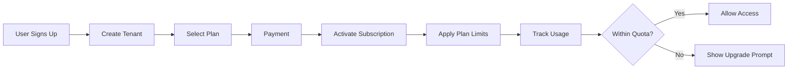

# SaaS Conversion Requirements

> **Project:** 3D Web - E-commerce Platform → SaaS  
> **Current Score:** 82/100 (E-commerce)  
> **Target:** Full SaaS Platform

---

## Executive Summary

Để chuyển đổi từ **E-commerce platform** sang **SaaS**, cần thêm các thành phần sau. Dự án hiện tại có thể scale lên SaaS với các modifications.

---

## 1. Multi-tenancy Architecture - CRITICAL

### Current State
- ❌ Single-tenant database
- ❌ No tenant isolation
- ❌ Shared storage (Google Drive)

### Required Changes

| Component | Current | Required | Effort |
|-----------|---------|----------|--------|
| Database Schema | Single | Multi-tenant | **HIGH** |
| Tenant ID in tables | ❌ | ✅ Required | HIGH |
| RLS per tenant | User-level | Tenant-level | HIGH |
| Tenant context middleware | ❌ | ✅ Required | MEDIUM |
| Storage isolation | Shared | Per-tenant | HIGH |

### Implementation Options

```
Option A: Database-per-tenant (Isolated)
├── Pros: Complete isolation, easy backup
├── Cons: Higher DB costs, more complex management
└── Best for: Enterprise/High-security

Option B: Shared database, schema-per-tenant
├── Pros: Lower cost, easier maintenance
├── Cons: Slightly less isolation
└── Best for: SMB/Mid-market

Option C: Shared database, row-level tenant
├── Pros: Lowest cost, simplest
├── Cons: Risk of data leakage
└── Best for: Startup/Low-tier
```

### Recommended: Option C (Row-level tenant)

```sql
-- Add tenant_id to all tables
ALTER TABLE profiles ADD COLUMN tenant_id UUID REFERENCES tenants(id);
ALTER TABLE orders ADD COLUMN tenant_id UUID REFERENCES tenants(id);
ALTER TABLE products ADD COLUMN tenant_id UUID REFERENCES tenants(id);

-- Update RLS policies
CREATE POLICY "Tenant isolation" ON orders 
    FOR ALL USING (auth.jwt()->>'tenant_id' = tenant_id::text);
```

---

## 2. Subscription & Billing System - CRITICAL

### Current State
- ✅ Static pricing (per product/service)
- ❌ No subscription model
- ❌ No usage tracking
- ❌ No billing portal

### Required Components

| Component | Description | Priority |
|-----------|-------------|----------|
| **Tenants Table** | Organization/company info | 🔴 HIGH |
| **Subscription Plans** | Plan definitions (Free, Pro, Enterprise) | 🔴 HIGH |
| **Plan Features** | Feature flags per plan | 🔴 HIGH |
| **Usage Tracking** | API calls, storage, users | 🔴 HIGH |
| **Usage Quotas** | Limits per plan | 🔴 HIGH |
| **Billing Portal** | Customer self-service | 🔴 HIGH |
| **Payment Integration** | Stripe/Paddle for subscriptions | 🔴 HIGH |
| **Invoices** | Auto-generated invoices | 🟡 MEDIUM |
| **Webhooks** | Payment status webhooks | 🟡 MEDIUM |

### Database Schema

```sql
-- Tenants (Organizations)
CREATE TABLE tenants (
    id UUID PRIMARY KEY DEFAULT uuid_generate_v4(),
    name TEXT NOT NULL,
    slug TEXT UNIQUE NOT NULL,
    plan_id UUID REFERENCES subscription_plans(id),
    status TEXT DEFAULT 'active' CHECK (status IN ('active', 'suspended', 'cancelled')),
    created_at TIMESTAMPTZ DEFAULT NOW(),
    updated_at TIMESTAMPTZ DEFAULT NOW()
);

-- Subscription Plans
CREATE TABLE subscription_plans (
    id UUID PRIMARY KEY DEFAULT uuid_generate_v4(),
    name TEXT NOT NULL, -- 'Free', 'Pro', 'Enterprise'
    price_monthly BIGINT NOT NULL, -- in cents
    price_yearly BIGINT NOT NULL,
    max_users INT DEFAULT 1,
    max_storage_gb INT DEFAULT 1,
    max_orders_per_month INT,
    features JSONB DEFAULT '{}',
    is_active BOOLEAN DEFAULT TRUE
);

-- Usage Tracking
CREATE TABLE usage_logs (
    id UUID PRIMARY KEY DEFAULT uuid_generate_v4(),
    tenant_id UUID REFERENCES tenants(id),
    metric TEXT NOT NULL, -- 'api_calls', 'storage', 'orders'
    count INT NOT NULL DEFAULT 1,
    period_start TIMESTAMPTZ NOT NULL,
    period_end TIMESTAMPTZ NOT NULL,
    created_at TIMESTAMPTZ DEFAULT NOW()
);
```

### Implementation Flow



---

## 3. User Management & Roles - HIGH

### Current State
- ✅ Basic RBAC (customer/admin)
- ❌ No organization hierarchy
- ❌ No team management
- ❌ No role permissions matrix

### Required Components

| Component | Description |
|-----------|-------------|
| **Tenant Users** | Users within organization |
| **Role Matrix** | Granular permissions |
| **Team Management** | Invite/remove members |
| **Role Invitations** | Pending invitations |
| **SSO/OIDC** | Enterprise SSO support |

### Role Hierarchy

```
Tenant Owner (1)
├── Admin (full access)
│   ├── Manager
│   │   ├── Staff
│   │   └── Support
│   └── Viewer (read-only)
└── Member (limited)
```

---

## 4. API Rate Limiting (Per Tenant) - MEDIUM

### Current State
- ✅ IP-based rate limiting
- ❌ No per-tenant limits

### Required

```typescript
// Update rate limiting to be tenant-aware
interface TenantRateLimit {
  tenant_id: string;
  plan: 'free' | 'pro' | 'enterprise';
  limits: {
    api_calls_per_minute: number;
    storage_gb: number;
    concurrent_sessions: number;
  };
}

// Enforce in middleware
async function checkTenantRateLimit(tenantId: string, plan: Plan) {
  const limit = PLAN_LIMITS[plan];
  const current = await getUsage(tenantId);
  
  if (current.api_calls >= limit.api_calls_per_minute) {
    throw new Error('Rate limit exceeded. Upgrade to Pro.');
  }
}
```

---

## 5. Usage & Analytics Dashboard - MEDIUM

### Required Components

| Component | Description |
|-----------|-------------|
| **Tenant Analytics** | Usage per tenant |
| **Billing Dashboard** | Revenue, MRR, churn |
| **Admin Overview** | All tenants status |
| **Audit Logs** | Tenant activity |

---

## 6. Isolation & Security - HIGH

### Additional Requirements

| Component | Required |
|-----------|----------|
| **Tenant Data Export** | GDPR compliance |
| **Tenant Deletion** | Data cleanup |
| **Data Residency** | Region selection |
| **SSO/SAML** | Enterprise auth |
| **IP Whitelisting** | Access control |
| **Audit Logging** | Per-tenant logs |

---

## 7. White-labeling (Optional) - LOW

If you want customers to have their own branding:

| Component | Description |
|-----------|-------------|
| Custom domain | customer.domain.com |
| Logo/branding | Per-tenant customization |
| Email templates | Custom sender |
| API branding | Custom API domain |

---

## Implementation Roadmap

### Phase 1: Multi-tenancy Foundation (4-6 weeks)
- [ ] Add tenant_id to all tables
- [ ] Create tenants table
- [ ] Update RLS policies
- [ ] Add tenant context to middleware

### Phase 2: Subscription System (4-6 weeks)
- [ ] Create subscription_plans table
- [ ] Integrate Stripe/Paddle
- [ ] Build billing portal
- [ ] Implement usage tracking
- [ ] Add quota enforcement

### Phase 3: Team Management (2-3 weeks)
- [ ] Tenant users table
- [ ] Role matrix
- [ ] Invite system
- [ ] Team dashboard

### Phase 4: Advanced Features (2-4 weeks)
- [ ] Usage analytics
- [ ] Tenant reporting
- [ ] SSO integration
- [ ] White-label support

---

## Technical Considerations

### Database
- Consider PostgreSQL schemas for better tenant isolation
- Index tenant_id on all queries
- Connection pooling per tenant if using Option A

### Caching
- Tenant-specific cache keys
- Clear cache on tenant switch
- Redis multi-tenant configuration

### API
- Tenant ID in all API responses
- Pagination with tenant scope
- Search across tenants (admin only)

---

## Estimated Effort

| Phase | Weeks | Complexity |
|-------|-------|------------|
| Phase 1: Foundation | 4-6 | HIGH |
| Phase 2: Billing | 4-6 | HIGH |
| Phase 3: Teams | 2-3 | MEDIUM |
| Phase 4: Advanced | 2-4 | MEDIUM |
| **Total** | **12-19** | |

---

## Alternatives

### Option A: Start Fresh
Build a new SaaS from scratch with multi-tenancy from day 1.

### Option B: Use SaaS Boilerplate
- Use Next.js SaaS starter kits (already have multi-tenancy)
- Migrate existing features

### Option C: Gradual Migration
1. Add tenant_id without breaking existing functionality
2. New features use multi-tenant approach
3. Migrate existing data gradually

---

## Recommendation

**Option C - Gradual Migration** is recommended because:
- ✅ Preserves existing functionality
- ✅ Lower risk
- ✅ Can ship incrementally
- ✅ Existing customers not affected

---

*Document created for SaaS conversion planning*
